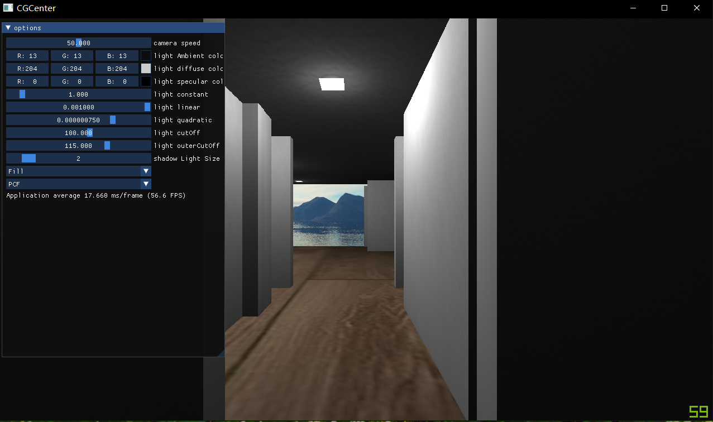

# CGCenter
a compute graphics learning &amp; coding center

**纸上得来终觉浅，绝知此事要躬行。**

这是一个使用opengl实现的渲染器，用来实践学到的图形学知识。当前该项目刚刚开工，只是有一些规划中要实现的东西，可能会根据时间以及未来的兴趣爱好改变 实现内容，希望能够坚持下去（一个flag）

另外自己家2023年也要交付装修了，希望能在2023年前能实现一个简单的家装系统。

目前规划中要实现的效果如下：

下一步需要做的：

添加transform component

texture的格式设置

program的uniform和mesh的draw解耦

解耦std的map和智能指针

光线追踪和GI

### 引擎基本功能：

- 加载模型
  - [x] obj
- 摄像机
  - [x] 可漫游摄像机
- 几何体
  - [x] 平面 Plane
  - [x] 三角网格 TriMesh
  - [x] 天空盒
- 材质
  - [ ] 镜子 Mirror
  - [x] 漫反射 Diffuse
- 光源
  - [x] 点光源 pointLight
  - [x] 面光源 AreaLight
  - [x] 直接光 DirectionalLight
  - [x] 聚光灯 SpotLight
- 渲染管线
  - [x] 正向渲染 forward rendering
  - [ ] 延迟渲染 deferred rendering
  - [ ] 延迟光照 deferred lighting、light pre-pass
  - [ ] 延迟贴图 deferred texture
- [ ] 拾取功能
- [ ] 重构成ECS

### 阴影 Shadow 

- [x] shadow map 
- [ ] CSM-hard
- [x] shadow-bias
- [x] PCF
- [x] PCSS
- [x] VSM

### 实时光线追踪
- [ ] BVH 加速结构
- [ ] 降噪器

### 全局光照 GI

- [ ] RSM
- [ ] LPV
- [ ] SSGI
- [ ] VXGI

### 环境光遮蔽 AO

- [ ] SSAO
- [ ] HBAO
- [ ] SSDO
- [ ] GTAO

### 环境光照 IBL

- [ ] split-sum
- [ ] PRT-diffuse
- [ ] PRT-glossy

### 后处理算法 postprocess
- [ ] bloom
- [ ] CAS
- [ ] DLSS

### GPU-Driven

### 虚拟纹理 Virtual Texture

### GPU 粒子

### 遮挡剔除

暂时的效果：

